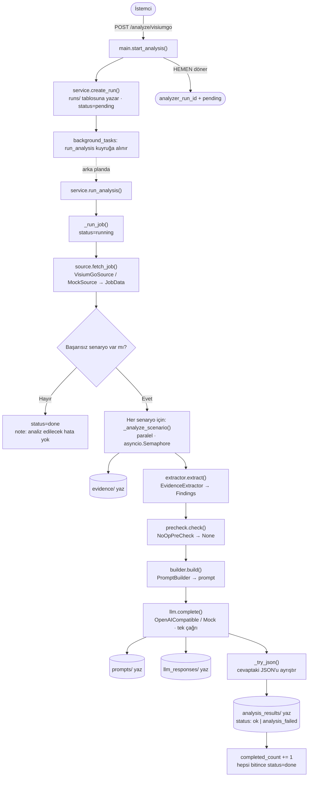
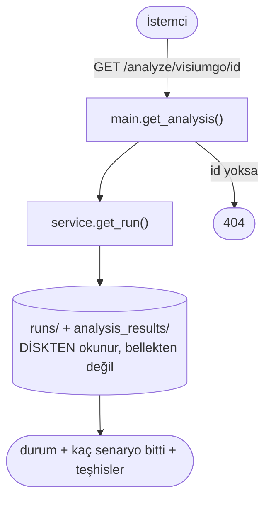
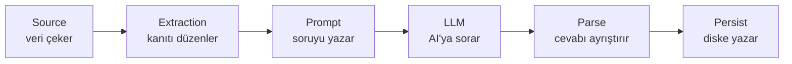
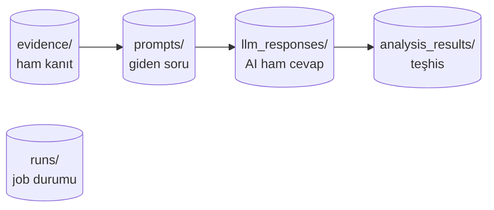

# Akış Şeması — VisiumGo Test Analyzer

> GitHub bu sayfadaki `mermaid` bloklarını otomatik olarak **görsel şema** olarak çizer.
> Detaylı anlatım: [nasil-calisir.md](nasil-calisir.md).

## 1) POST + Arka plan (analiz başlar ve çalışır)

## 2) GET (durum ve sonuç sorgulanır)

## Halkalar (kim ne yapar)

## Diske düşen tam iz (aynı result_id ile bağlı)

